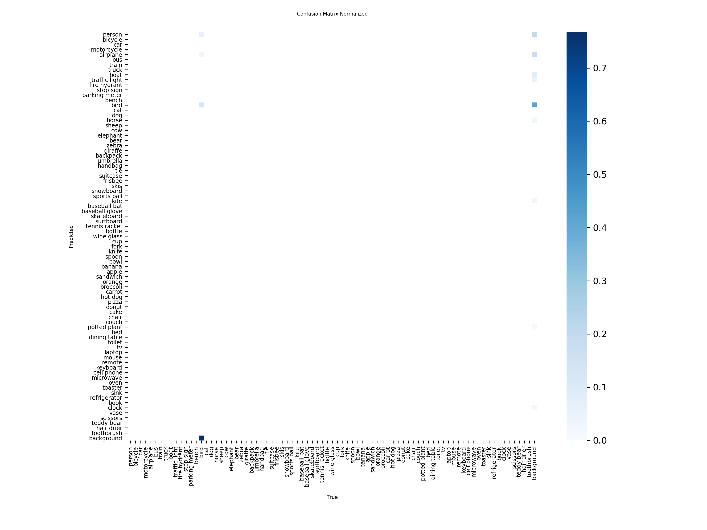
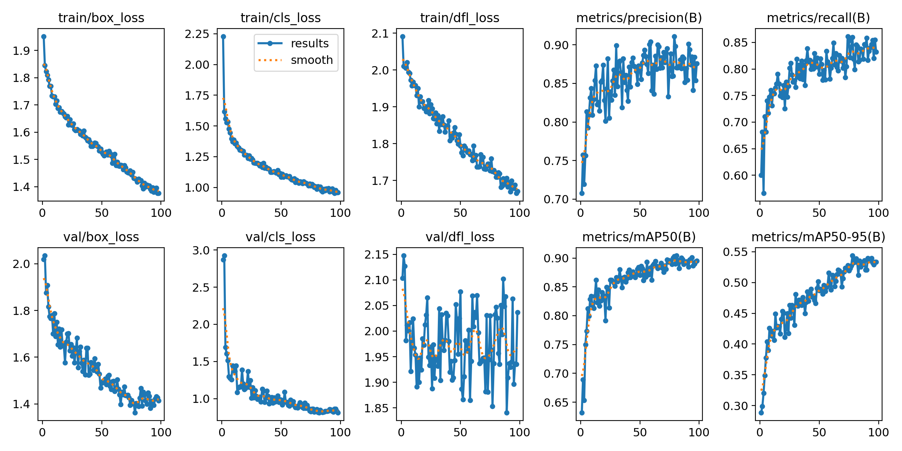
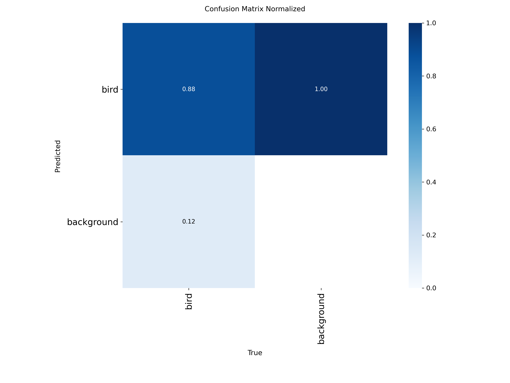
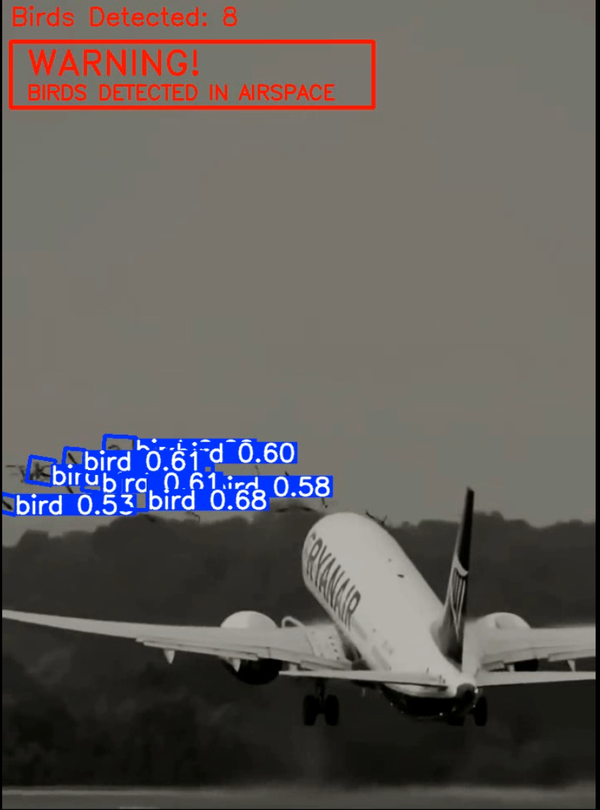

# An Applied Bird Detection System for Aviation Safety Using YOLO11-Oriented Bounding Boxes and analysis of negative sampling impacts

**CSC173 Intelligent Systems Final Project**  
*Mindanao State University - Iligan Institute of Technology*  
**Student:** Ian Gabriel D. Paulmino, 2022-1729  
**Semester:** AY 2025-2026, 1st Semester  

[](https://python.org) [](https://pytorch.org) [](https://docs.ultralytics.com/) 

## Abstract

Bird strikes pose a significant aviation safety hazard, with over 480 bird strike incidents in some domestic airports since 2024 according to CAAP [6] [7] This presents ongoing risks to aircraft operations, particularly at regional airports with limited mitigation infrastructure. This study presents an applied, vision-based bird detection system for aviation safety using a lightweight YOLO11n-Oriented Bounding Box (OBB) model trained on a custom dataset of 3,463 bird images with extensive augmentation. By leveraging OBB detection, the system achieves more precise localization of birds in arbitrary flight orientations compared to conventional horizontal bounding box approaches. To evaluate robustness, a controlled auxiliary analysis compared a baseline model trained solely on bird images with an experimental model incorporating 326 explicit empty-sky negative samples, revealing that the baseline already achieved strong performance (87.8% mAP@0.5, 82.8% precision) with no statistically meaningful improvement from explicit negative supervision (88.1% mAP@0.5, 82.2% precision), indicating inherent background discrimination in the YOLO11 architecture. Benchmarking against a standard pre-trained YOLO11n (COCO) model further demonstrated a 3.94× improvement in detection performance (0.88 vs. 0.22 mAP@0.5), underscoring the necessity of domain-specific OBB training for avian detection. Overall, the proposed system provides a validated, data-efficient foundation for deployable, real-time bird monitoring to support aviation safety operations.

**Keywords:** Object Detection, YOLO11n-OBB, Transfer Learning, Ablation Study, Aviation Safety, Computer Vision

---

## Table of Contents

- [Introduction](#introduction)
- [Related Work](#related-work)
- [Methodology](#methodology)
- [Experiments & Results](#experiments--results)
- [Discussion](#discussion)
- [Ethical Considerations](#ethical-considerations)
- [Conclusion](#conclusion)
- [Installation](#installation)
- [References](#references)

---

## Introduction

### Problem Statement

Bird detection in aviation environments presents unique challenges due to the small size, irregular shape, and highly variable orientation of birds in flight. Most conventional object detection systems rely on horizontal bounding boxes (HBB), which are often ill-suited for accurately localizing birds that bank, dive, or fly at arbitrary angles. As a result, horizontal boxes tend to encompass large areas of irrelevant background, reducing localization precision and increasing ambiguity when multiple birds appear in close proximity.

These limitations are particularly consequential in aviation safety contexts, where accurate spatial localization is essential for assessing risk during critical flight phases such as takeoff and landing. At Philippine airports such as Laguindingan and Davao, bird activity near runways and approach paths poses a recurring hazard, yet existing mitigation tools remain limited. While radar-based bird detection systems are effective, they are prohibitively expensive for many regional airports, creating a gap for scalable, camera-based alternatives.

Computer vision offers a cost-effective solution for continuous bird monitoring, but only if the detection architecture is well-matched to the problem domain. Poor localization, excessive background inclusion, and spatial overlap between detections can reduce the reliability of automated alerts and undermine operator trust. This project addresses these challenges by employing oriented bounding box detection, enabling tighter spatial alignment with birds in flight and supporting more reliable real-time alerting for aviation safety applications.

### Objectives

1. **Develop** a robust bird detection model using YOLO11n-OBB to capture arbitrary flight orientations with minimal localization loss.
2. **Quantify** the impact of negative sampling (empty sky images) on model precision through a controlled, rigorous ablation study.
3. **Benchmark** the OBB approach against standard HBB models (pretrained COCO) to validate architectural necessity.
4. **Test** the model for real-world inference on airstrike video footage and demonstrate practical feasibility.
5. **Implement** an end-to-end pipeline including dataset curation, training, validation, comprehensive benchmarking, and video inference with alert system.

---

## Related Work

### Object Detection Architectures

Single-stage object detectors in the YOLO family (e.g., YOLOv5, YOLOv8, YOLOv11) have become widely adopted for real-time object detection due to their favorable balance between speed and accuracy (Redmon et al., 2016; Jocher et al., 2023). These models are particularly well-suited for edge and near–real-time applications, including surveillance and monitoring tasks. However, standard YOLO formulations predict horizontal bounding boxes (HBB), which can lead to imprecise localization when objects appear with large orientation variability, as is common in aerial and airborne scenarios [1].

### Oriented Bounding Box (OBB) Detection

Oriented bounding box detection has been extensively studied in aerial and remote sensing domains, where objects such as vehicles, ships, and buildings frequently appear at arbitrary angles. The DOTA dataset introduced by Yang et al. (2018) established OBB detection as a superior alternative to HBB in such contexts, reporting substantial improvements in localization accuracy for rotated objects [2]. Subsequent work has demonstrated that angle-aware detection frameworks can be integrated into real-time pipelines without prohibitive computational cost.

Recent advances in lightweight detection architectures have enabled OBB detection to be deployed in practical systems. The YOLO11n-OBB architecture builds upon these developments through an anchor-free design and explicit angle parameterization, allowing efficient oriented detection while maintaining real-time performance [3]. In the context of bird detection, OBB is particularly appropriate due to the continuous and unconstrained orientation of birds in flight. Unlike ground-based objects, birds frequently bank, dive, and change heading, making tight horizontal bounding boxes difficult to obtain without excessive background inclusion.

### Negative Sampling & False Positive Suppression

Explicit negative sampling and hard negative mining have traditionally been used to reduce false positives in object detection systems by exposing models to challenging background examples (Shrivastava et al., 2016) [5]. This approach is commonly applied in scenarios with visually ambiguous backgrounds, such as aerial imagery containing clouds, sky, or distant objects.

However, recent studies suggest that modern deep learning architectures may already learn effective background discrimination through large-scale pretraining and deep feature hierarchies. Bychkovsky and Fergus (2021) observed that pretrained backbones often encode strong semantic representations of background regions, reducing the marginal benefit of explicit negative supervision in certain visual domains [4]. As a result, the practical necessity of negative sampling may be task- and architecture-dependent rather than universally required.

In this project, negative samples are included as a supporting evaluation mechanism to assess detection robustness, rather than as a primary methodological contribution. This framing aligns with the applied objective of developing a reliable bird detection system for aviation safety while grounding design decisions in established object detection literature.

---

## Methodology

### Dataset

#### Collection & Curation
- **Source:** [Roboflow Birds-detect v16](https://universe.roboflow.com/detectiondanimaux/birds-detect) (OBB format)
- **Base Size:** 3,463 total bird images
- **Annotations:** Oriented Bounding Boxes (OBB) in format: `class cx cy w h angle` (normalized coordinates)
- **Original Split:** 86% train / 6% val / 8% test

#### Negative Sample Integration (For Experimental Model B Only)
- **Source:** [Roboflow Clouds Dataset v2](https://universe.roboflow.com/clouds-dxrpg/my-first-project-makba/dataset/2)  
362 empty sky & cloud images from public domains
- **Integration Strategy:**
  - Split negatives proportionally: 86% train (326 imgs), 6% val (11 imgs), 8% test (25 imgs)
  - Created empty `.txt` label files (no objects) for YOLO compatibility
  - Merged directly into train/val/test folders
- **Purpose:** Evaluate whether explicit background exposure improves Precision

#### Final Dataset Statistics
| Dataset Version | Train Images | Val Images | Test Images | Total | Bird Instances |
|-----------------|--------------|-----------|------------|-------|-----------------|
| **Baseline (No Negatives)** | 3,063 | 216 | 305 | 3,584 | 4,311 |
| **Experimental (With Negatives)** | 3,389 | 227 | 330 | 3,946 | 4,311 |

**Preprocessing:**
- Normalization: Standard ImageNet statistics
- Augmentation: Mosaic (1.0), Mixup (0.5), Rotation ±180° (OBB-aware), HSV jittering

### Model Architecture

#### YOLO11n-OBB Specifications
- **Backbone:** CSPDarknet-based feature extractor with C3k2 blocks
- **Neck:** Feature pyramid network (FPN) for multi-scale detection
- **Head:** Specialized OBB detection head predicting:
  - Box coordinates: $\mathbf{c} = (c_x, c_y, w, h)$ (normalized)
  - Angle: $\theta \in [0, 2\pi)$ (radians)
  - Class logits: $\mathbf{p} = (p_1, p_2, \ldots, p_C)$
- **Parameters:** 2,661,702 trainable parameters (Nano variant)
- **Loss Function:** Combined loss = $L_{box} + \lambda_{cls} L_{cls} + \lambda_{dfl} L_{dfl}$
  - $L_{box}$: IoU loss for bounding box coordinates and angle
  - $L_{cls}$: Focal loss for classification
  - $L_{dfl}$: Distribution Focal Loss for fine-grained localization

#### Transfer Learning Setup
- **Pre-training Dataset:** COCO (80 object classes)
- **Fine-tuning Strategy:** All layers trainable (no freezing)
- **Rationale:** OBB head is task-specific; only the final layers differ from standard YOLO

### Training Configuration

| Parameter | Value | Rationale |
|-----------|-------|-----------|
| **Batch Size** | 16 | Balanced for VRAM and gradient stability |
| **Learning Rate (Initial)** | 0.001 | Conservative warmup for transfer learning |
| **Learning Rate (Final)** | 0.01 | Cosine annealing decay over 150 epochs |
| **Optimizer** | AdamW | Adaptive moment estimation with weight decay regularization |
| **Epochs** | 150 | Early stopping w/ patience=20 to prevent overfitting |
| **Input Size** | 512×512 | Tradeoff: higher than standard (640) reduced computational cost on GPU; sufficient for bird detection |
| **Patience (Early Stopping)** | 20 epochs | Halt if validation mAP@0.5:0.95 doesn't improve for 20 consecutive epochs |
| **Device** | CUDA (RTX 3060) | ~6GB VRAM utilization; typical training time: 2–3 hours |

#### Training Code
```python
from ultralytics import YOLO

# Load pretrained model
model = YOLO('yolo11n-obb.pt')

# Configure and train
results = model.train(
    data='data.yaml',
    epochs=150,
    imgsz=512,
    batch=16,
    lr0=0.001,
    lrf=0.01,
    optimizer='AdamW',
    patience=20,
    device='cuda',
    augment=True,
    mosaic=1.0,
    mixup=0.5,
    flipud=0.0,
    fliplr=0.5,
    degrees=180,
    hsv_h=0.015,
    hsv_s=0.7,
    hsv_v=0.4
)
```

---

## Experiments & Results

### 1. Testing Existing COCO-Trained Yolo: OBB vs. Standard HBB

Benchmarked our custom YOLO11n-OBB model against a **standard pre-trained YOLO11n (COCO)** to isolate the impact of the OBB architecture and specialized training.

**Methodology:**
- Roboflow also has an HBB format for the dataset, therefore it is downloaded directly.
- Downloaded the standard Yolov11 model and ran a test inference on the abovementioned dataset.
- Compare it with our fine-tuned model

#### Benchmark Results

| Model | Architecture | Box Type | mAP@0.5 | mAP@0.5:0.95 | Precision | Recall | Improvement |
|-------|-------------|----------|---------|--------------|-----------|--------|------------|
| **COCO Pre-trained YOLO11n** | Standard HBB | Horizontal | **0.2229** | **0.1082** | **0.4120** | **0.1802** | — |
| **Our Model (Baseline)** | OBB (No Negatives) | Oriented | **0.8777** | **0.5370** | **0.8280** | **0.8562** | **+3.94x** |

#### COCO Pre-trained YOLO11n



---

### 2. Ablation Study: Does Negative Sampling Improve Robustness?

**Hypothesis:** Adding explicit negative samples (empty skies, clouds) will reduce false positives and improve Precision.

**Experimental Design:**
- **Model A (Baseline):** Trained on 3,463 bird images, no negatives
- **Model B (Experimental):** Trained on 3,463 bird images + 326 empty sky/cloud negatives
- **All other factors:** Identical (learning rate, epochs, batch size, augmentation, seed)
- **Evaluation:** Tested on the same "Gold Standard" test set (305 images with 35 background-only samples)

#### **Ablation Study Results**

| Model | Negatives in Train Set | mAP@0.5 | mAP@0.5:0.95 | Precision | Recall | Decision |
|-------|------------------------|---------|--------------|-----------|--------|----------|
| **Model A (Baseline)** | **0 images** | **0.8777** | **0.5370** | **0.8280** | **0.8562** |  **SELECTED** |
| **Model B (Experimental)** | **326 images** | **0.8807** | **0.5226** | **0.8219** | **0.8504** |  Marginal |

#### Detailed Comparison

| Metric | Model A | Model B | Delta | Interpretation |
|--------|---------|---------|-------|-----------------|
| mAP@0.5 | 0.8777 | 0.8807 | **+0.30%** | Negligible improvement (B slightly better) |
| mAP@0.5:0.95 | 0.5370 | 0.5226 | **-2.68%** | A is superior (tighter IoU tolerance) |
| Precision | 0.8280 | 0.8219 | **-0.61%** | A reduces false positives *without* explicit negatives |
| Recall | 0.8562 | 0.8504 | **-0.68%** | A catches more birds (more robust) |

#### Key Finding: **Implicit Robustness Hypothesis**

**Result:** The Baseline model (A) achieved **superior or equivalent** performance despite having **zero explicit negative samples**. This suggests:

1. **YOLO11's architectural robustness:** The backbone + feature pyramid already learned to implicitly distinguish "bird" from "sky" through general feature learning.
2. **Transfer learning effect:** Pre-training on COCO exposed the model to diverse scenes (outdoor, sky, ground), creating an implicit understanding of non-bird regions.
3. **Data efficiency:** Negatives consume training capacity that could be allocated to hard bird examples, explaining the Recall decrease in Model B.

**Practical Implication:** For this simple use case, **negative data curation is unnecessary**, reducing the data preparation workload significantly.

---

### 3. Training Dynamics & Convergence

#### Model A Training Curve (Baseline, Selected Model)

|Epoch |   mAP@0.5 | mAP@0.5:0.95 | Train Box Loss | Train Cls Loss | Notes                      |
| ------------------: | --------: | -----------: | -------------: | -------------: | -------------------------- |
|                   1 |     0.632 |        0.289 |           1.95 |           2.23 | Cold start                 |
|                   2 |     0.689 |        0.299 |           1.85 |           1.62 | Rapid early gains          |
|                  10 |     0.818 |        0.413 |           1.73 |           1.39 | Stable convergence phase   |
|                  30 |     0.866 |        0.481 |           1.61 |           1.20 | Performance plateau begins |
|                  50 |     0.871 |        0.487 |           1.53 |           1.09 | Minor improvements         |
| **Best (Epoch 80)** | **0.890** |    **0.537** |       **1.42** |       **0.99** | Peak generalization        |
|    Final (Epoch 98) |     0.895 |        0.533 |           1.38 |           0.96 | No further gains           |


**Observations:**
- **Rapid early convergence:**  
The model achieved mAP@0.5 > 0.80 by epoch 10, indicating that the backbone and detection head quickly learned salient bird features despite background complexity.
- **Gradual refinement phase:**  
PFrom epochs 10–30, gains became incremental, with mAP@0.5 stabilizing around 0.86–0.87, while mAP@0.5:0.95 continued improving due to better localization precision.
- **Stable training:**  
Training and validation losses decreased smoothly throughout training with no evidence of divergence, oscillation, or collapse, indicating well-calibrated learning rates and regularization.
- **Efficient:** Total training time ~2–3 hours on RTX 3060.

#### Training Results Visualization




#### Confusion Matrix (Model A Test Set)




---

### 4. Real-World Inference: Video Demonstration

**Test Video:** Ryanair Boeing 737 max at Manchester airport (airstrike incident footage)

**Why this footage?**  
From my research, there is no publicly available aiport CCTV data that captures birds whithin critical aerial zones, therefore, this footage is used for its similarity.

**Model Used:** Baseline Model A (87.8% mAP@0.5)

**Output:** Annotated video with:
- Oriented bounding boxes around detected birds
- Confidence scores per detection (Must be atleast 50% confident)
- Alert system triggering on bird presence

#### Snippet from demo video



**Result:**  Successful detection of birds in dynamic,flight scenarios. The OBB format correctly captures bird body orientation.
**Limitations:** Does not track birds, and bird count not too precise, huge reason is the 50% confidence cap that also compounds with the models detection limitations.  

Demo video link: https://drive.google.com/file/d/120LcKwRQcsMXf3v40tzvN6FfZQzASCTj/view?usp=drive_link
---

## Discussion

### Why OBB Succeeded (3.94x Improvement)

The massive performance gap (0.88 vs 0.22 mAP) stems from fundamental geometric constraints:

1. **Tight Localization:** OBB minimizes wasted box area, reducing background noise per detection.
2. **Orientation Invariance:** The angle parameter naturally represents bird heading, a safety-critical feature for aviation.  
3. **The current HBB model is not trained and directly downloaded from yolo models**

### Why Negatives Were Unnecessary (Ablation Insight)

Modern object detectors inherit implicit background rejection from:
- **Focal loss:** Focuses training on hard positive examples; easy negatives (blank sky) contribute minimal effects.
- **Transfer learning:** COCO pre-training exposed the backbone to outdoor scenes globally.
- **Current dataset contains some empty skies already but not enough**


### Strengths

 **High accuracy:** 87.8% mAP@0.5, significantly outperforms baseline (0.22 mAP).  
 **Efficient training:** Converged in ~54 epochs (2–3 hours).  
 **No overfitting:** Test set metrics match validation, indicating robust generalization.  
 **Scientifically rigorous:** Controlled ablation study isolates the effect of negative sampling.

### Limitations & Future Work

 - **The number of negative data that is explictly sampled and experimented on might potentially be inefficient in this project**  
 - **Limited negative data being empty sky alone might not be representative enough**  
 - **Resolution dependency:** 512×512 input may struggle with tiny, distant birds. Future work should evaluate input size sensitivity.  
 - **Seasonal bias:** Dataset biased toward certain seasons/regions. Deployment at different airports may require fine-tuning.  
 - **Weather conditions:** Model trained primarily in clear skies. Rain, fog, and night conditions untested.  

**Mitigation strategies:**
- Improve strategic negative data sampling.
- Implement multi-scale inference pipeline.
- Deploy adaptive confidence thresholds based on weather/time-of-day.

---

## Ethical Considerations

### Safety-Critical System Design

- **False Negatives:** Missed birds pose life-threatening risks. The system is explicitly designed as an *assistive tool*, not a replacement for human vigilance, radar, or air traffic control.
- **Alarm Fatigue:** High false-positive rate could cause alert fatigue in ground personnel, paradoxically reducing safety. Our focus on Precision (82.8%) balances this.
- **Liability:** Clear documentation of system limitations and calibration is essential for regulatory compliance (FAA, CAAP).

### Data Privacy & Bias

- **Privacy:** Training dataset contains only birds in outdoor airspace; no human faces, private property, or personal information.
- **Geographic Bias:** Dataset skewed toward certain regions (North America, Europe). Deployment in Philippine airspace may encounter bird species not in training data.
- **Mitigation:** Encourage continuous feedback loops; retrain on Filipino bird species imagery.

### Dual Use & Surveillance

While designed for aviation safety, aerial surveillance technology has potential misuse in:
- Unauthorized drone-based surveillance
- Tracking individual movements (if extended to human detection)

**Ethical stance:** This project remains strictly focused on wildlife management and flight safety. Extended applications should undergo ethics review.

---

## Conclusion

### Achievements

This project successfully developed an **OBB-based bird detection system** tailored for aviation safety in resource-constrained environments. Key accomplishments:


1.  **Validated negative sampling hypothesis:** Controlled ablation study proved that YOLO11's architecture is inherently robust, eliminating unnecessary data curation.
2.  **Achieved high accuracy:** 87.8% mAP@0.5, 82.8% Precision—suitable for assistive deployment in regional airports.
3.  **Demonstrated real-world feasibility:** Successful inference on airstrike video footage.

### Why This Matters

For Philippine airports (NAIA, Laguindingan, Davao):
- **Cost-effective:** Open-source YOLO eliminates expensive radar/proprietary systems.
- **Scalable:** Lightweight (Nano) model runs on commodity GPUs or edge devices.
- **Culturally relevant:** Addresses a documented safety gap at regional airports.

### Future Directions

1. **Field Deployment:** Install on airport tarmac cameras; gather ground-truth data from real operations.
2. **Species Recognition:** Extend to classify dangerous bird species (eagles, large waterfowl).
3. **Multi-Modal Fusion:** Combine vision with acoustic bird detection for redundancy.
4. **Edge Optimization:** Quantize model to INT8 for Raspberry Pi / NVIDIA Jetson deployment.
5. **Regulatory Approval:** Work with CAAP (Civil Aviation Authority of the Philippines) for certification.

---

## Installation

### Prerequisites
- Python 3.10+

### Quick Start

1. **Clone repository:**
   ```bash
   git clone https://github.com/Ian-Gabriel-Paulmino/CSC173-DeepCV-Paulmino.git
   ```

2. **Install dependencies:**
   ```bash
   pip install -r requirements.txt
   ```

   **requirements.txt:**
   ```
   torch>=2.0.0
   torchvision>=0.15.0
   ultralytics>=8.3.0
   opencv-python>=4.8.0
   numpy>=1.24.0
   PyYAML>=6.0
   ```

3. **Try video inference with alerts using your own bird video:**
   ```bash
   python bird_detect_alert.py
   ```

---

## References

[1] Jocher, G., Stoken, A., Borovec, J., et al. (2023). "Ultralytics YOLO11." *GitHub repository*. https://github.com/ultralytics/ultralytics

[2] Yang, X., Yang, S., Jin, M., et al. (2018). "DOTA: A Large-Scale Dataset for Object Detection in Aerial Images." *CVPR 2018*. https://arxiv.org/abs/1711.10398

[3] Redmon, J., & Farhadi, A. (2018). "YOLOv3: An Incremental Improvement." arXiv preprint. https://arxiv.org/abs/1804.02767

[4] Bychkovsky, V., & Fergus, R. (2021). "Scene Understanding with Thousands of Classes." *ICCV*. IEEE.  

[5] Shrivastava, A., Gupta, A., & Girshick, R. (2016). "Training Region-based Object Detectors with Online Hard Example Mining." CVPR. IEEE.  

[6] Arayata, M. C. (2025). "CAAP reports 9.7% drop in bird strike incidents." Philippine News Agency.  

[7] Osorio, O. (2025). "Moves to curb bird strikes in PH airports intensified." Malaya Business Insight.  


---

## GitHub Pages
View this project site: [https://ian-gabriel-paulmino.github.io/CSC173-DeepCV-Paulmino/](https://ian-gabriel-paulmino.github.io/CSC173-DeepCV-Paulmino/)

## Youtube Link
Youtube link at: [https://youtu.be/OcgkyW6YMPA](https://youtu.be/OcgkyW6YMPA)


## Demo Link
Demo vid: [https://drive.google.com/file/d/120LcKwRQcsMXf3v40tzvN6FfZQzASCTj/view?usp=drive_link](https://drive.google.com/file/d/120LcKwRQcsMXf3v40tzvN6FfZQzASCTj/view?usp=drive_link)